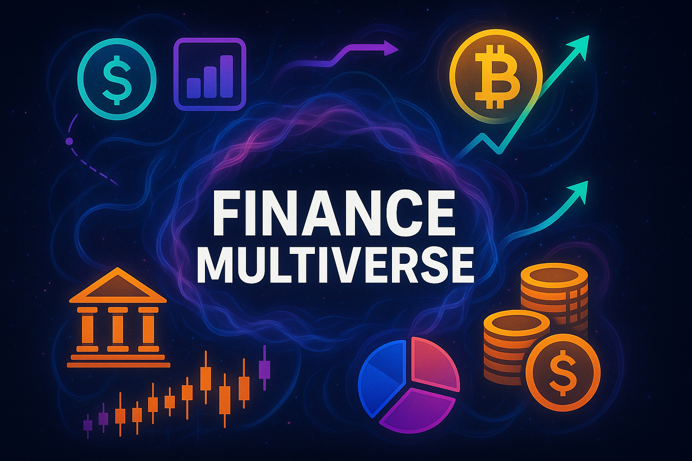

<p align="center">
  
</p>


---

##👨‍💻 Team Members

Member 1 — Wall Street Theme

Member 2 — Retro 80s Theme

Member 3 — Eco Theme

Member 4 — Space Theme

Instructor: Dr. Usama Arshad (AF3005, FAST-NUCES)
## 🌟 Overview

Welcome to **Finance Multiverse** – a creative, interactive machine learning app for exploring financial data in four exciting worlds!  
Built as a group project for FAST-NUCES Programming for Finance (AF3005).

---


## 🎨 Features

- **Four Unique Themes:**  
  - 🏛️ Wall Street (Linear Regression)  
  - 🕹️ Retro 80s (Logistic Regression, binary helper & neon visuals)  
  - 🌳 Eco/Nature (K-Means Clustering)  
  - 🚀 Space (Linear Regression)
- **Two Data Sources:**  
  - Upload your own Kaggle CSV file  
  - Fetch live stock data from Yahoo Finance
- **Interactive ML Models:**  
  - Model selection, feature picking, visual results, and accuracy scores
- **Custom Visuals & GIFs:**  
  - Each theme features distinct design, images, and animation
- **User-Friendly:**  
  - All error messages and options explained simply  
  - Binary target creation helper for logistic regression
- **Ready for Deployment:**  
  - Modular, clean code; easy to expand or update

---

## 📁 Project Structure

├── app.py
├── welcome.py
├── utils.py
├── requirements.txt
├── README.md
├── assets/
│ ├── main_logo.png
│ └── main_banner.png (optional)
└── themes/
├── wallstreet_theme.py
├── retro_theme.py
├── eco_theme.py
└── space_theme.py


---

---

## 🔗 Live Demo

Try it now:  
**[Finance Multiverse Streamlit App](https://programming-for-finance-project-jrfn9ezgtsonv3kdepeuhp.streamlit.app/)**

---


## 🚀 How to Run Locally

1. **Clone the repository:**
   ```bash
   git clone https://github.com/yourusername/yourrepo.git
   cd Programming-For-Finance_Project
2. Install dependencies:

pip install -r requirements.txt

3. Start the app:
streamlit run app.py
